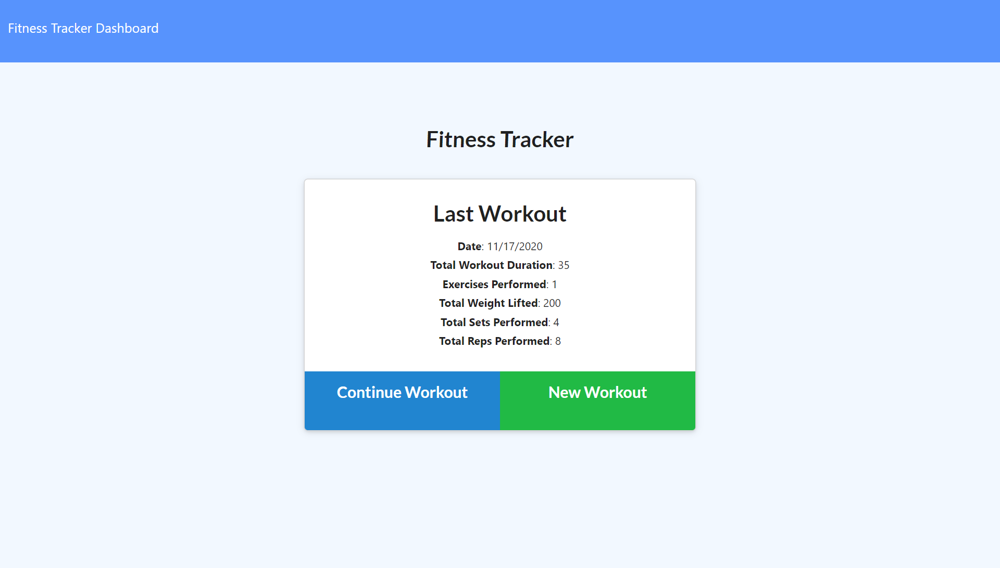
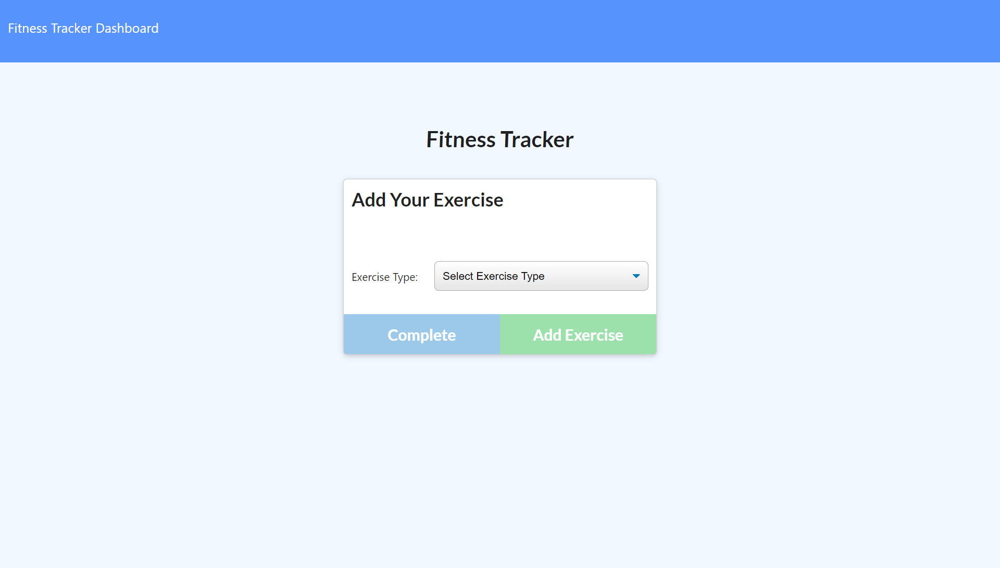
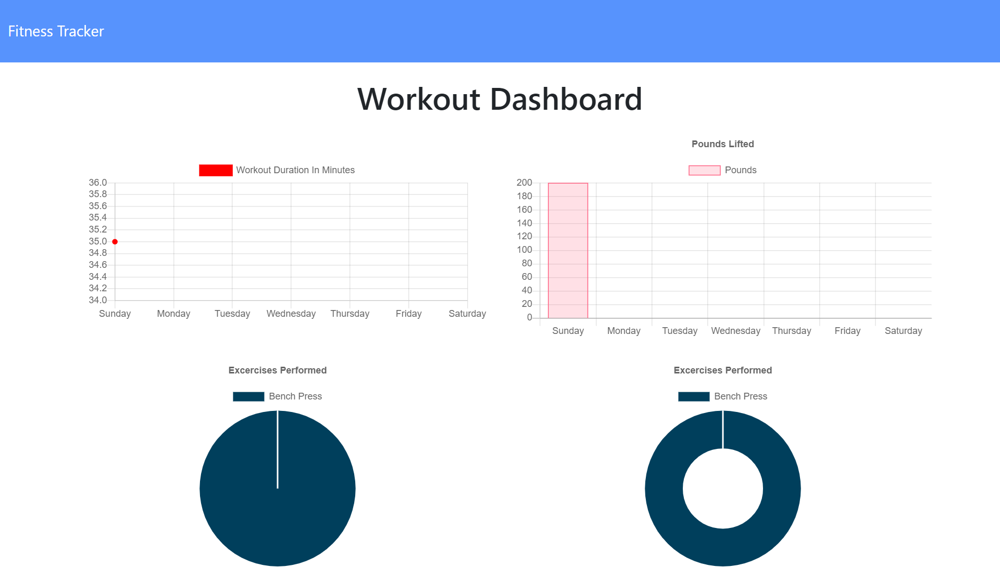

# Workout Tracker
  

## Description

I want to be able to view, create and track daily workouts. I want to be able to log multiple exercises in a workout on a given day. I should also be able to track the name, type, weight, sets, reps, and duration of exercise. If the exercise is a cardio exercise, I should be able to track my distance traveled.

## Table of Contents

* [installation](#installation)
* [usage](#usage)
* [license](#license)
* [contributing](#contributing)
* [test](#tests)
* [questions](#questions)

To install necessary dependencies run the following command

npm install

## Usage
  * Add exercises to a previous workout plan.

  * Add new exercises to a new workout plan.

  * View the combined weight of multiple exercises on the `stats` page.

## License
      
      This project is licensed under the MIT license.

## Contributing

N/A

## Tests
To run test run the following command:
'''
npm test
'''

## Deployed site
[Deployed site](https://workout-tracker-ct.herokuapp.com/)

## Screenshots of application

### Dashboard

### Exercise

### Stats

## Questions
If you have any questions about the repo contact me directly at c.trahan94@yahoo.com.
You can find more of my work at [ctrahan94](https://github.com/ctrahan94).

